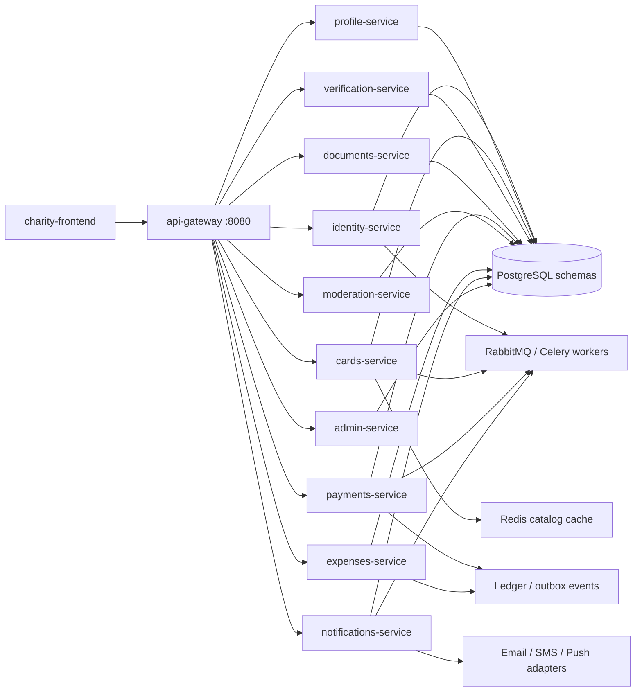

# е-Көмек

Demo: https://bice-delta.vercel.app

Production target from `e-komek_FINAL_TZ_v3.md`. Runtime is a microservice system behind an API gateway. The previous Django monolith in `charity-backend/` is kept as the MVP logic reference and is not the Docker runtime.

## Local production-like runtime

By default Compose starts **HTTP services only** (no Celery workers). That is enough for UI/API demos on a laptop. Full async delivery needs `--profile workers`.

```bash
cp .env.example .env
docker compose up --build
```

If port `8080` is busy (or the laptop struggles), use the e2e port map — still without workers:

```bash
docker compose -f docker-compose.yml -f docker-compose.e2e.yml -p e-komek up --build -d
```

- Frontend (default): http://localhost:5173 — or http://localhost:15173 with e2e overlay
- API gateway: http://localhost:8080 — or http://localhost:18080 with e2e overlay

Celery workers (optional, heavy):

```bash
docker compose --profile workers up -d
# with e2e ports:
docker compose -f docker-compose.yml -f docker-compose.e2e.yml -p e-komek --profile workers up -d
```

After containers are healthy:

```bash
docker compose exec identity-service python manage.py seed_users
docker compose exec verification-service python manage.py seed_medregistry
docker compose exec verification-service python manage.py seed_antifraud
docker compose exec admin-service python manage.py seed_admin
```

- Gateway health: http://localhost:8080/health (or `:18080/health`)
- Gateway metrics: http://localhost:8080/metrics
- RabbitMQ UI: http://localhost:15672 (ekomek / ekomek)

Frontend talks only to the API gateway (`VITE_API_URL=http://localhost:8080/api`). Direct calls to backend services are not part of the public contract.

## Architecture



Each backend service has its own PostgreSQL schema (`deploy/postgres/init.sql`), Dockerfile, `/health/` endpoint, outbox table where needed, and Celery worker. Services communicate over HTTP (`/internal/...`) and domain events via RabbitMQ. They do not import each other's Python code — only `ekomek_common` shared library.

## Services

| Service | Owns |
|---|---|
| api-gateway | routing, CORS, rate limit, correlation IDs, aggregate health |
| identity-service | users, JWT, roles, balance, ECP registration |
| profile-service | user profiles, beneficiaries, representation |
| cards-service | fundraising cards, catalog, trust badges, risk, duplicates |
| verification-service | ECP verify, medregistry, antifraud |
| documents-service | card documents, versioning |
| payments-service | donations, redistribution, stats, webhooks |
| moderation-service | moderation decisions, reports, manual review |
| expenses-service | expenses, invoices, payouts, ledger |
| notifications-service | in-app notification center, async delivery |
| admin-service | settings, city/diagnosis dictionaries, risk config |

Donor refund-to-balance is closed. Public leftover handling is redirect to another active fundraiser, leave funds with the family, or keep funds on the current card until verification/review finishes. Historical `RefundDecision` rows and `refund_in` balance transactions are kept. Legacy `/api/refunds/` endpoints return 410; use `/api/redistribution/`.

## Environment variables

Copy `.env.example` to `.env`. Critical production values:

| Variable | Purpose |
|---|---|
| `SECRET_KEY`, `JWT_SIGNING_KEY` | Django/JWT signing — must be unique per environment |
| `INTERNAL_SERVICE_TOKEN` | Service-to-service auth on `/internal/` |
| `IIN_HMAC_PEPPER`, `SENSITIVE_ENCRYPTION_KEY` | IIN hashing and field encryption |
| `ECP_ADAPTER`, `ECP_VERIFIER_URL` | ECP path: `ncalayer` + verifier URL for stage/prod |
| `MEDICAL_SOURCE_ADAPTER`, `MEDICAL_SOURCE_URL` | Official medical/eGov source or dev fallback |
| `PAYMENT_ADAPTER`, `FREEDOMPAY_*` | `freedompay` + merchant credentials for stage/prod |
| `PAYOUT_ADAPTER` | Clinic payout provider |
| `DEBUG` | Must be `False` in production |

Docker Compose defaults (`PAYMENT_ADAPTER=dev`, `PAYOUT_ADAPTER=dev`, `DEBUG=True`) are for local development only.

## Tests

Install shared package once, then run per service:

```bash
pip install -e packages/ekomek_common
python services/identity/manage.py test identity
python services/api-gateway/tests.py   # via pytest
```

Latest local run (221 tests, all passing):

| Service | Tests |
|---|---|
| identity | 24 |
| profile | 21 |
| cards | 65 |
| verification | 11 |
| documents | 10 |
| payments | 23 |
| moderation | 17 |
| expenses | 24 |
| notifications | 15 |
| admin | 11 |
| api-gateway | 10 |

Coverage includes: ECP registration, beneficiary/representation flows, duplicate detection, risk engine, trust badges, document versioning, signed payment webhooks + idempotency, ledger reconciliation, payout workflow, revision/complaints/suspension, notification center, redistribution (refund disabled).

Browser E2E uses Playwright from `charity-frontend/` and runs against the real API gateway.

```bash
docker compose down -v
docker compose -f docker-compose.yml -f docker-compose.e2e.yml build --no-cache
docker compose -f docker-compose.yml -f docker-compose.e2e.yml up -d
docker compose exec identity-service python manage.py seed_users
docker compose exec verification-service python manage.py seed_medregistry
docker compose exec verification-service python manage.py seed_antifraud
docker compose exec admin-service python manage.py seed_admin
cd charity-frontend
npx playwright install chromium
npm run test:e2e
```

`docker-compose.e2e.yml` switches ECP, medical source, payment, and payout adapters to local dev/test mode, exposes the gateway on `http://127.0.0.1:18080`, frontend on `http://127.0.0.1:15173`, and points payment redirects there. Celery workers stay off unless you add `--profile workers`.

## Production blockers (external access required)

These cannot be completed without credentials, contracts, or legal access:

| Integration | Blocker | Local substitute |
|---|---|---|
| NCALayer / NCA PKI ECP | Production/stage verifier URL, NCA certificate chain, OCSP policy | `ECP_ADAPTER=dev` in tests; `ncalayer` adapter code exists |
| Official medical / eGov source | Contract + API credentials for DamuMed/eGov-like registry | `MEDICAL_SOURCE_ADAPTER=dev` (seed_medregistry) |
| FreedomPay payments | Merchant ID + secret from FreedomPay | `PAYMENT_ADAPTER=dev` with signed dev webhooks |
| Bank / clinic payout provider | Provider contract + API keys | `PAYOUT_ADAPTER=dev` |
| SMS / push delivery | SMS gateway credentials, FCM/APNs keys | In-app notifications work; email/SMS/push use dev adapters |
| Production secrets | Real `SECRET_KEY`, peppers, encryption keys | `.env.example` placeholders; never commit `.env` |

## Observability

- **Correlation IDs**: `X-Request-ID` / `X-Correlation-ID` propagated gateway → services → internal calls
- **Structured logs**: JSON via `ekomek_common.logging` on all Django services
- **Metrics**: Prometheus at gateway `/metrics` and each service `/metrics/` (via `ekomek_common.urls`)
- **Health**: each service `/health/` + gateway aggregate `/health` with dependency status
- **Tracing**: not wired (OpenTelemetry/Jaeger would require external collector)

## Демо-аккаунты

Все пароли: `demo123456`

| Email | Роль | ИИН |
|-------|------|-----|
| admin@charity.test | админ | 870308301456 |
| moderator1@charity.test | модератор | 890711401671 |
| moderator2@charity.test | модератор | 890711401672 |
| author1@charity.test | автор | 850315301231 |
| author2@charity.test | автор | 850315301232 |
| author3@charity.test | автор | 850315301233 |
| donor1@charity.test | донор | 930615402341 |
| donor2@charity.test | донор | 930615402342 |
| donor3@charity.test | донор | 930615402343 |
| donor4@charity.test | донор | 930615402344 |

Высокий риск блокирует регистрацию **автора** и создание сбора. Донор с high-risk ИИН может зарегистрироваться. Проверка идёт через verification-service, не через прямое чтение таблиц.
# e-komek
